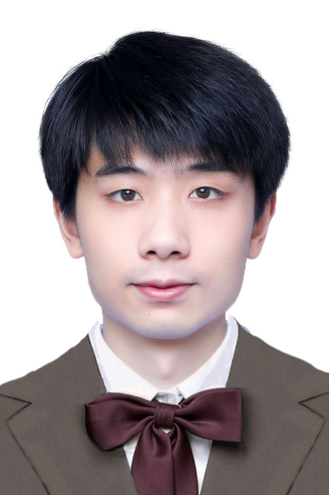
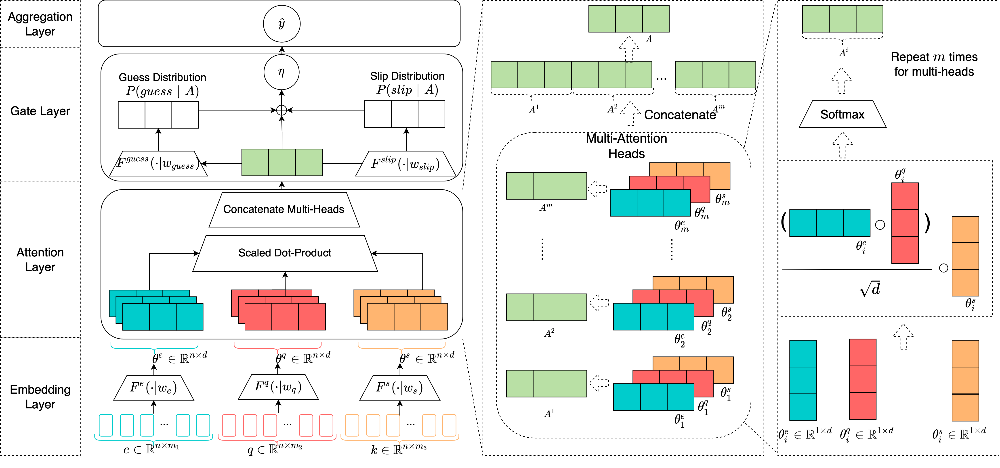

## About Me

 

Hi! I am Terry 😊, a researcher at the University of Sydney. I major in deep learning at the school of computer science.
I am interested in applying advanced deep learning methods into software engineering and recommendation system.

**Research Field**: NLP/NLU, Multi-Modalities, Software Engineering, Educational Data Mining. I also have rich experience on image and video data processing during the industry internship.

**Recent Work** Build an AI search engine for the neural network.

Find out more at my [[CV]](CV.pdf).

<!-- Before coming to Peking University in 2017, I studied at Tongji University.
 -->

## Recent News

**Win the "Best Student Paper" awarded by ICDM as the first author** [[Award News]](https://twitter.com/icdm2022/status/1595243601545826304)

**Two first author top papers has been Accepted.** [[Accepted News]](https://www.cse.fau.edu/~xqzhu/icdm2022/ICDM2022Program.pdf)

## Academic Publications

 Poster | Publication | Title | More
-----|-----|-----|-----|-----
 | **ICDM 2022** | Contrastive Code-Comment Pre-training | [[Code]](https://github.com/TerryPei/C3P) [[Paper]](https://github.com/Terry000/papers/blob/main/C-3-P/C-3-P.pdf) [[Video]](https://github.com/Terry000/papers/blob/main/C-3-P/c3p.m4v)
 | **ICDM 2022** | Self-Attention Gated Model for Cognitive Diagnosis Task | [[Code]](https://github.com/TerryPei/AGCDM) [[Paper]](https://github.com/Terry000/papers/blob/main/AGCDM/AGCDM.pdf) [[Poster]](https://github.com/TerryPei/AGCDM/blob/main/results/figs/poster.png)

## Industry projects
**Dynamic Face Detection**

Function: Detect face dynamic bbox, live action recognition and distinguish true/fake live videos, 
The copyright of the code belongs to the commercial authority and cannot be open source. If you are interested, the demo can be provided as a display.

## Honors and Awards
A Best Student Paper (2022)

Two Full-Scholarship (2019-2020, 2020-2021)

Outstanding Graduate (2019)

National Second Prize in Mathematics Competition (2018)

Provincial Second Prize in Blue Bridge Cup Programming Competition (2018)

## Academic Services

Reviewer of NeurIPS, ICDM, AAAI.

## Contact

* Email: [terrypei123@gmail.com](terrypei123@gmail.com)
